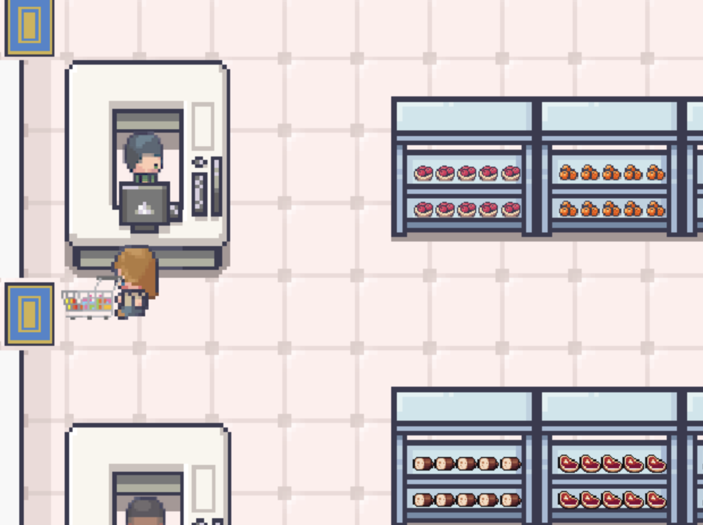

# ShopperSimulation2

Authors: Travis Clauson, Lidi Yafei, Professor Matthias Scheutz, Tufts CS Department

Submission Date: 11/28/2022

Personal Contributions: Agent.java

Summary: This is code for a homework assignment in 'CS-139 Ethics for AI' tuaght by professor Matthias Scheutz. Supermarket Shoppping Simulation is a virtual supermarket where agents can perform tasks like filling up a shopping cart, follow a shopping list, and paying. The agents can either be controlled by keyboard input or by an autonomus agent. This autonomous agent, whose behavior is defined in Agent.java, is me and Lidi Yafei's contribution. Our agent can navigate through its environment, shop from its predefined list, checkout, and leave the store. It performs these actions all while following basic norms: avoiding fellow agents, not putting items back on the wrong shelf, not blocking the aisles etc. 

To Try the Code: Follow the directions in  or in 

Disclaimer: Every file here, except Agent.java was given to us by our professor. 

